# 第二堂：序列模型 & 多模態 — RNN, LSTM, ELMo, Transformer

第二堂課我們要從處理「空間」的 CNN，跳到處理「時間/序列」的模型，並且一路講到現在所有大型語言模型背後的基礎 — Transformer。學弟們上完這堂課，應該要能理解：為什麼會有 RNN？為什麼 RNN 不夠用？Transformer 到底解決了什麼問題？以及現在這麼多多模態模型，背後其實只有一個簡單的核心想法。

## 課程大綱

| CH.| 內容  |
|------|------|
| 1. 為什麼需要序列模型？ | 從 CNN 的限制談起，引出「順序」的重要性 |
| 2. RNN | hidden state、權重共享、BPTT、梯度消失 |
| 3. LSTM | 三個 Gate、cell state、為什麼能解決長序列問題 |
| 4. ELMo | Character CNN + biLSTM、上下文相關 embedding |
| 5. Transformer | Self-Attention、Multi-Head、Positional Encoding、整體架構 |
| 6. BERT vs GPT | Encoder-only vs Decoder-only，兩條路線 |
| 7. 多模態模型 | CLIP、BLIP、LLaVA 的設計思路 |
| 8. Q&A + 作業說明 | — |

### 模型演進路線圖

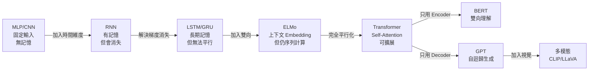

---

## 1. 為什麼需要序列模型？

上一堂我們講的 CNN，本質上是在處理「空間」的問題 — 一張圖片每個 pixel 的位置是固定的，CNN 透過 kernel 在空間上滑來滑去，找出 local pattern，再一層一層組合成更大的概念。

但是世界上很多資料不是「空間性」的，而是「時間性」或「順序性」的：

- 一句話：「我今天很開心」vs「我今天不開心」— 順序變了意思就完全不同
- 一段語音：每一個時間點的音訊都要連起來才有意義
- 股價走勢：今天的價格跟昨天有關，跟前天也有關
- 影片：每一幀跟前後幀有強烈的關聯性

如果硬要用 CNN 或 MLP 來處理這種資料，會遇到兩個大問題：

1. **輸入長度不固定**：MLP 要求輸入是固定維度的，但句子有長有短
2. **沒辦法記住前面的資訊**：每個輸入都被獨立處理，模型不知道「之前發生了什麼」

所以我們需要一種新架構：**它要能記住過去看過的東西，然後用這個記憶來幫助理解現在的輸入**。這就是 RNN 的出發點。

### 具體例子：為什麼 MLP 做不到？

假設要做「情感分類」— 判斷一句話是正面還是負面：

- 輸入：「今天天氣真好，我心情很愉快」（10 個字）
- 輸入：「好」（1 個字）

MLP 要求固定維度，你只能用 padding 把短的句子補到跟最長句子一樣長，但這很浪費，而且你必須**事先決定最大長度**。更嚴重的是，即使你把 10 個字的 embedding 都 flatten 成一個大向量餵進去，MLP 也**不知道「真」出現在「好」的前面這件事很重要** — 它只看到一堆數字。

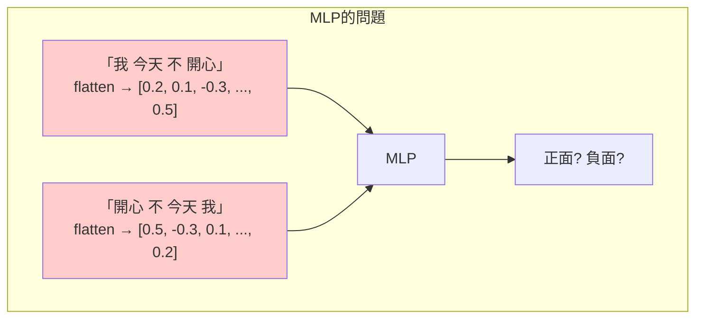

上面兩句語意完全不同，但如果 MLP 只是把所有字的 embedding 加起來或平均，兩句的向量可能非常接近（因為組成的字一樣），模型就分不出差異。

---

## 2. RNN（Recurrent Neural Network）

### 核心想法：加一條「自己連到自己」的線

普通的神經網路是「輸入 → 隱藏層 → 輸出」，資訊只往前流。RNN 做了一件很簡單的事：**把上一個時間點的隱藏層輸出，當作這一個時間點的額外輸入**。

這條多出來的線，就是所謂的 **recurrent connection（循環連接）**。

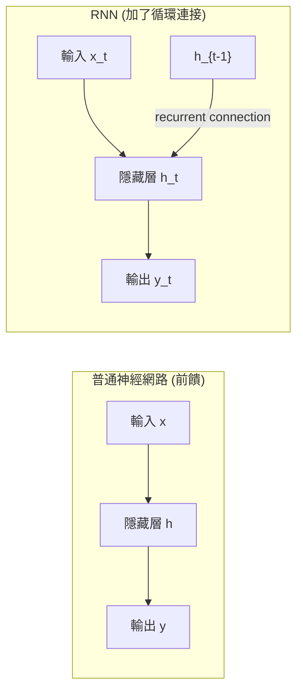

### 數學長這樣

每個時間點 $t$，RNN 做兩件事：

**1. 更新 hidden state（記憶）：**

$$h_t = \tanh(W_{xh} x_t + W_{hh} h_{t-1} + b_h)$$

- $x_t$：當前時間點的輸入（例如第 t 個字的 embedding）
- $h_{t-1}$：上一個時間點的 hidden state（記憶）
- $W_{xh}$：把輸入投影到 hidden 空間的權重
- $W_{hh}$：把舊記憶投影到新記憶空間的權重
- $\tanh$：把數值壓到 -1 到 1 之間，避免爆炸

**2. 產生輸出：**

$$y_t = W_{hy} h_t + b_y$$

### 重要觀念：權重共享（Weight Sharing）

RNN 處理一句 10 個字的句子，**不是用 10 組不同的權重**，而是同一組 $W_{xh}, W_{hh}, W_{hy}$ 用 10 次。這跟 CNN 的 kernel 共享是同樣的思想 — 不管字出現在哪個位置，處理它的方式都應該一樣。

這也代表：**RNN 可以處理任意長度的輸入**，因為權重數量跟序列長度無關。

#### 具體計算例子：RNN 處理 "好 開 心"

假設 hidden size = 2（實際上會大得多），embedding size = 2：

- 字的 embedding：好=[1, 0]、開=[0, 1]、心=[1, 1]
- $W_{xh}$ = [[0.5, 0.3], [0.2, 0.7]]（2×2 矩陣）
- $W_{hh}$ = [[0.1, 0.4], [0.6, 0.2]]（2×2 矩陣）
- 初始 $h_0$ = [0, 0]

**t=1（讀到「好」，x₁=[1, 0]）：**

$h_1 = \tanh(W_{xh} \cdot [1,0] + W_{hh} \cdot [0,0])$  
$= \tanh([0.5, 0.2] + [0, 0])$  
$= \tanh([0.5, 0.2])$  
$= [0.46, 0.20]$

**t=2（讀到「開」，x₂=[0, 1]）：**

$h_2 = \tanh(W_{xh} \cdot [0,1] + W_{hh} \cdot [0.46, 0.20])$  
$= \tanh([0.3, 0.7] + [0.1×0.46+0.4×0.20, 0.6×0.46+0.2×0.20])$  
$= \tanh([0.3, 0.7] + [0.126, 0.316])$  
$= \tanh([0.426, 1.016])$  
$= [0.40, 0.77]$

注意 $h_2$ 裡面同時包含了「好」和「開」的資訊 — 這就是 RNN 的「記憶」。

### 怎麼訓練？BPTT（Backpropagation Through Time）

訓練 RNN 的方法叫做「時間上的反向傳播」。概念其實很簡單：把 RNN 在時間軸上「攤開」（unroll），就會變成一個很深的前饋網路，然後用普通的反向傳播去算梯度。

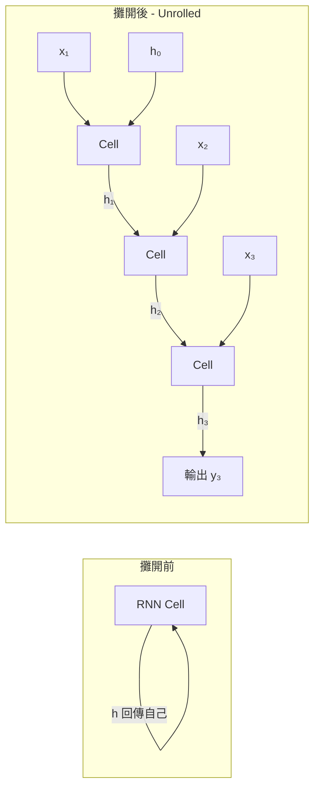

> **術語解釋 — Unroll（展開）**：把 RNN 的循環結構在時間軸上複製多份，每個時間步一份。展開後的結構就像一個很深的前饋網路，每一「層」其實是同一組權重（因為 RNN 權重共享），但它接受不同時間步的輸入。這讓我們可以直接用一般的反向傳播去計算梯度。

#### BPTT 的計算流程

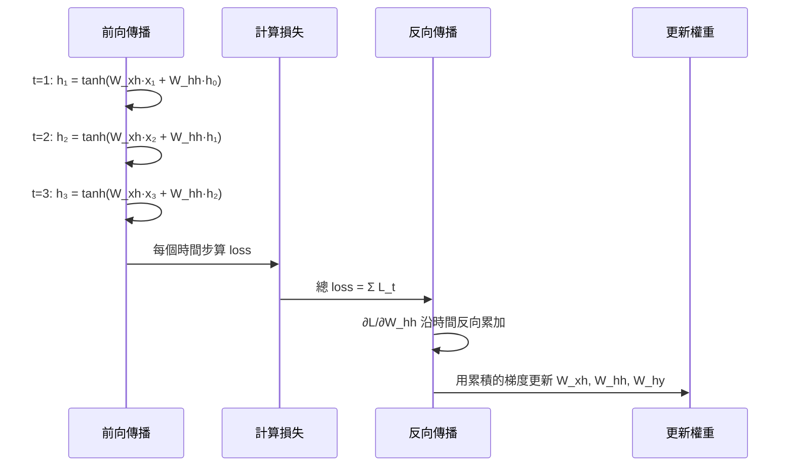

### RNN 的致命傷：梯度消失/爆炸

當序列很長的時候，反向傳播要經過很多層 $W_{hh}$ 的乘法。

想像一下：如果 $W_{hh}$ 的某個 eigenvalue 是 0.9，乘 50 次就變成 $0.9^{50} \approx 0.005$ — 梯度幾乎消失。如果 eigenvalue 是 1.1，乘 50 次就變成 $1.1^{50} \approx 117$ — 梯度爆炸。

> **術語解釋 — Eigenvalue（特徵值）**：一個方陣 $A$ 的 eigenvalue $\lambda$ 代表「這個矩陣在某個方向上的縮放倍率」。如果 $Av = \lambda v$，那 $v$ 就是對應的 eigenvector，$\lambda$ 就是 eigenvalue。在 RNN 中，$W_{hh}$ 反覆乘自己，相當於每個 eigenvalue 反覆乘以自己，所以 $|λ| < 1$ 會消失，$|λ| > 1$ 會爆炸。

#### 具體數值例子：梯度消失

假設序列長度 T=50，我們要算第 50 步的 loss 對第 1 步的 hidden state 的梯度：

$$\frac{\partial L_{50}}{\partial h_1} = \frac{\partial L_{50}}{\partial h_{50}} \cdot \prod_{t=2}^{50} \frac{\partial h_t}{\partial h_{t-1}}$$

每一步 $\frac{\partial h_t}{\partial h_{t-1}}$ 大約等於 $W_{hh} \cdot \text{diag}(\tanh'(...))$

- $\tanh'$ 的最大值是 1（在 0 附近），通常 < 1
- 假設平均每步的有效縮放是 0.9
- 50 步後：$0.9^{50} = 0.0052$ → 幾乎沒有梯度了

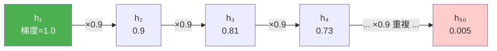

**結論：RNN 在實務上很難記住超過 10~20 步以前的資訊。**

這就是為什麼我們需要 LSTM。

---

## 3. LSTM（Long Short-Term Memory）

### 核心想法：給模型一條「高速公路」

LSTM 是 1997 年 Hochreiter 和 Schmidhuber 提出的，它的關鍵 insight 是：

> 與其讓記憶被反覆地 matrix multiply 搞到消失，不如**另外開一條通道**，讓記憶可以幾乎原封不動地一路傳下去，只在必要的時候才修改它。

這條額外的通道就是 **cell state $C_t$**，可以想成是 LSTM 的「主要記憶體」。而 hidden state $h_t$ 變成「對外輸出的東西」。

### LSTM Cell 的內部結構

LSTM 用三個 gate 來控制 cell state 的修改：

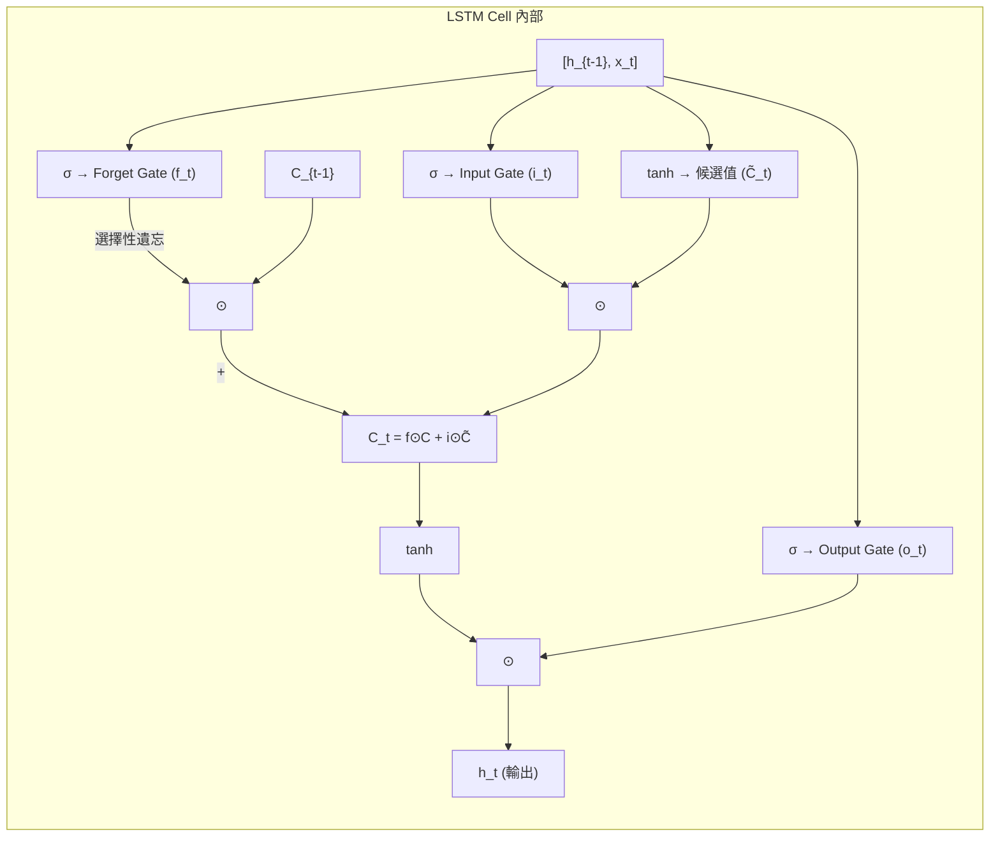

#### Gate 1：Forget Gate（要忘掉什麼）

$$f_t = \sigma(W_f \cdot [h_{t-1}, x_t] + b_f)$$

Sigmoid 把每個維度的值壓到 0~1 之間。**0 代表完全忘掉，1 代表完全保留。**

舉例：句子讀到「。」之後遇到新主詞，模型應該把「上一個主詞」忘掉，這時候 forget gate 就會輸出接近 0 的值，把舊的主詞資訊清空。

> **術語解釋 — Sigmoid (σ)**：函數 $\sigma(x) = \frac{1}{1 + e^{-x}}$，把任意實數壓到 (0, 1) 之間。在 LSTM 中它被用在 gate 上，因為我們需要一個 0~1 的「開關值」— 0 代表完全關閉（忘掉/不寫入/不輸出），1 代表完全打開（保留/寫入/輸出）。中間值代表「部分通過」。

#### Gate 2：Input Gate（要寫入什麼新資訊）

這個 gate 分兩部分：

$$i_t = \sigma(W_i \cdot [h_{t-1}, x_t] + b_i) \quad \text{← 決定要寫多少}$$

$$\tilde{C}_t = \tanh(W_C \cdot [h_{t-1}, x_t] + b_C) \quad \text{← 候選的新內容}$$

`i_t` 像是一個「寫入閥門」，`C̃_t` 像是「準備要寫的內容」。兩個相乘就是「實際要新加的東西」。

#### 更新 Cell State

$$C_t = f_t \odot C_{t-1} + i_t \odot \tilde{C}_t$$

注意這個式子有多漂亮：

- 第一項 $f_t \odot C_{t-1}$：把舊記憶選擇性地保留
- 第二項 $i_t \odot \tilde{C}_t$：把新資訊選擇性地寫入
- **這是相加，不是相乘** — 這就是為什麼梯度不會消失！梯度沿著 cell state 的高速公路可以幾乎無損地往回傳。

> **為什麼「加法」能解決梯度消失？** 反向傳播時 $\frac{\partial C_t}{\partial C_{t-1}} = f_t$（一個接近 1 的值），而不是像 RNN 那樣是 $W_{hh}$ 連乘。只要 forget gate 不把值設成 0，梯度就能幾乎原封不動地沿著 cell state 一路傳回去，就像高速公路一樣暢通。

#### 具體例子：LSTM 如何記住主詞

假設模型在處理：「**那隻黑色的貓**，在經過了很多條街道和巷弄之後，最後終於**回到了家**」

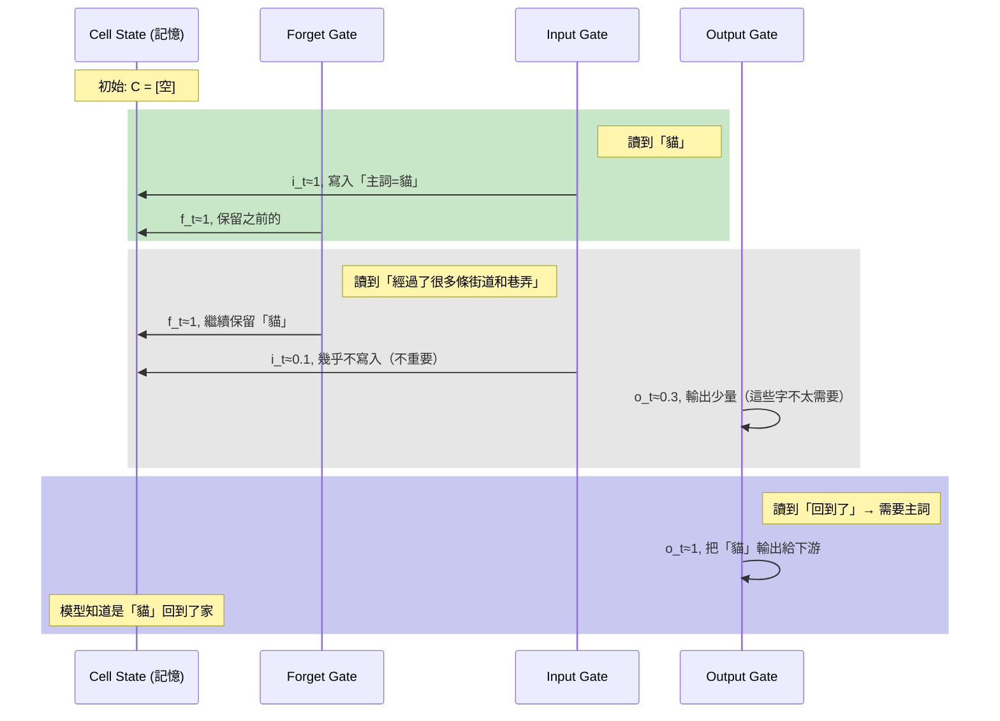

在這個例子裡，即使中間隔了十幾個字，LSTM 的 cell state 因為 forget gate 持續輸出接近 1 的值，「貓」的資訊就被保留下來了。

#### Gate 3：Output Gate（要輸出什麼）

$$o_t = \sigma(W_o \cdot [h_{t-1}, x_t] + b_o)$$

$$h_t = o_t \odot \tanh(C_t)$$

cell state 可能存了一堆東西，但這個時間點不見得每個都要輸出。output gate 決定這次要把哪些部分露出來給下游用。

### 一張圖看 LSTM 全貌

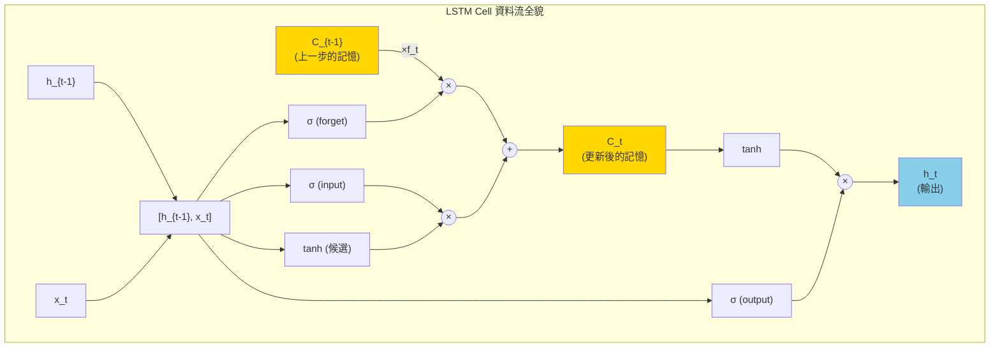

### 一句話總結 LSTM

> RNN 是「強迫每個時間點都重寫記憶」，LSTM 是「讓模型自己決定什麼時候要改記憶、改哪裡、改成什麼」。

### GRU（順帶一提）

GRU 是 LSTM 的簡化版，把三個 gate 合併成兩個（reset gate 和 update gate），cell state 跟 hidden state 也合併。參數比較少，效果通常跟 LSTM 差不多，看你的資料喜歡哪種。

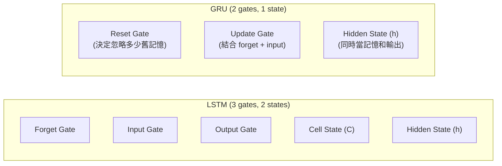

> **白話比喻**：LSTM 像是一台有 3 個旋鈕（forget、input、output）的機器，你可以精細控制。GRU 把旋鈕簡化成 2 個，操作更簡單，結果通常也差不多好。在小資料集上 GRU 有時候訓練更穩定（因為參數少，不容易 overfit）。

---

## 4. ELMo（Embeddings from Language Models）

### 在 Transformer 出現之前的最後一道光

ELMo 是 2018 年 AllenAI 提出的，它在序列模型發展史上很特別 — 它是**雙向 LSTM 的最後輝煌**，同時也是「contextualized embedding」這個重要概念的開創者。

### 解決什麼問題？Word2Vec / GloVe 的限制

在 ELMo 之前，大家用的是 Word2Vec 或 GloVe — 每個字對應到一個固定的向量。問題是：

- 「我去**銀行**領錢」
- 「我坐在河**岸**邊」（英文都是 bank）

這兩個 "bank" 在 Word2Vec 裡是**完全一樣的向量**，但意思完全不同。

> **術語解釋 — Word2Vec**：2013 年 Mikolov 在 Google 提出。核心想法是「一個字的意思由它的鄰居決定」（distributional hypothesis）。用兩種方式訓練：CBOW（用周圍的字預測中間的字）和 Skip-gram（用中間的字預測周圍的字）。訓練完後，每個詞得到一個固定向量，有趣的是向量之間可以做算術：king - man + woman ≈ queen。
>
> **術語解釋 — GloVe (Global Vectors)**：2014 年 Stanford 的 Pennington 等人提出。跟 Word2Vec 的差異是它基於**全局共現統計**（整個語料庫中兩個字同時出現的頻率矩陣），而不是局部窗口。數學上更優雅，效果跟 Word2Vec 差不多。

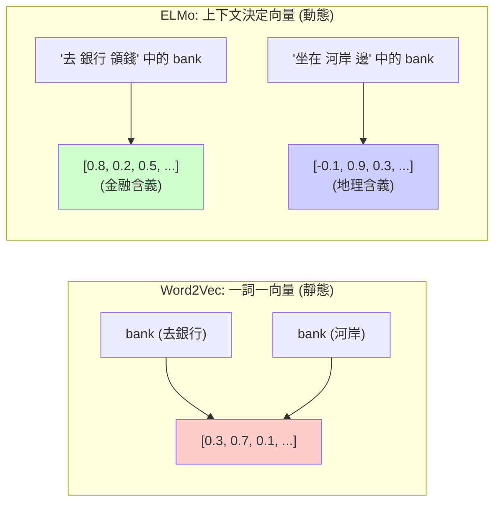

ELMo 的核心想法：**字的向量應該根據它在句子裡的上下文來決定**。

### ELMo 的架構（這個要記細節）

ELMo 由三層組成，由下往上：

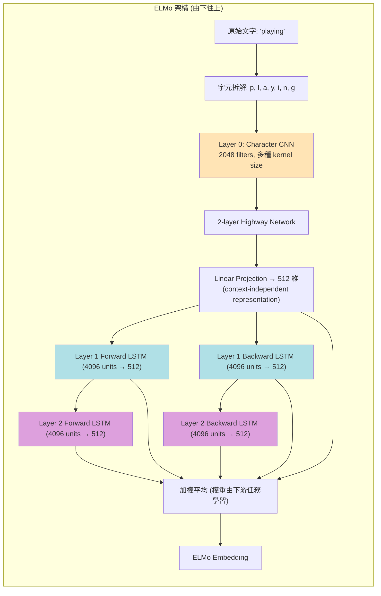

#### 第 0 層：Character-level CNN

ELMo **不是直接吃 word embedding**，它是吃字元。流程如下：

1. 每個字（word）拆成字元（character）
2. 字元 embedding 經過 **2048 個 character n-gram convolutional filter**（不同 kernel size 抓不同長度的字根）
3. 經過 **2 層 highway network**（類似 residual，幫助訓練）
4. 最後 linear projection 到 **512 維**，得到一個 context-independent 的 token representation $x_k^{LM}$

為什麼用字元？因為這樣可以處理 **OOV（沒看過的字）**，例如新造的詞、拼錯的字、罕見的人名等等。

> **術語解釋 — OOV (Out-Of-Vocabulary)**：指不在模型訓練詞彙表中的字詞。例如 Word2Vec 如果訓練時沒見過 "ChatGPT" 這個詞，遇到它就完全不知道怎麼表示。但 ELMo 用字元 CNN，即使沒見過 "ChatGPT"，它還是能從 C-h-a-t-G-P-T 這些字元組合中抽出特徵（比如 "-GPT" 這個 suffix 可能暗示它跟技術有關）。

> **術語解釋 — Highway Network**：一種加了「門控機制」的前饋網路，概念類似 LSTM 的 gate。公式是 $y = H(x) \cdot T(x) + x \cdot (1 - T(x))$，其中 $T(x)$ 是 transform gate（sigmoid），決定讓多少「新計算」通過、多少「原始輸入」直接跳過。這讓深層網路更容易訓練，是 residual connection 的前身。

#### 第 1、2 層：雙向 LSTM（biLSTM）

把上面的 token representation 餵給 **2 層 biLSTM**：

- **Forward LM**：$\overrightarrow{h}_{k,j}^{LM}$ — 從左往右讀，根據前面預測下一個字
- **Backward LM**：$\overleftarrow{h}_{k,j}^{LM}$ — 從右往左讀，根據後面預測前一個字

每層 LSTM 有 4096 個 hidden units，但會 projection 回 512 維。層與層之間還有 **residual connection**。

#### ELMo 的最終 embedding

對每個 token $t_k$，ELMo 會產生 **2L+1 個 representation**（L=2 層 biLSTM，所以是 5 個）：

- 1 個 character CNN 的輸出
- 2 個 forward LSTM 各層的輸出
- 2 個 backward LSTM 各層的輸出（forward 跟 backward 在每層會 concat 起來）

最終的 ELMo embedding 是這些 layer 的 **加權平均**，權重 $s^{task}$ 是根據下游任務學的：

$$\text{ELMo}_k^{task} = \gamma^{task} \sum_{j=0}^{L} s_j^{task} \cdot h_{k,j}^{LM}$$

實驗發現很有趣的事：**不同的 layer 學到不同的東西**。低層的 LSTM 比較會做 syntax（詞性標註之類），高層的 LSTM 比較會做 semantics（語意消歧）。所以加權平均讓不同任務可以取用它需要的層。

#### 不同層學到什麼？— 具體例子

以 "He deposited money in the **bank**" 這句話為例：

| Layer | 抓到的資訊 | 例子 |
|-------|-----------|------|
| Layer 0 (Char CNN) | 詞的形態特徵 | "bank" 是 4 個字母、沒有前後綴 → 可能是名詞 |
| Layer 1 (低層 biLSTM) | 語法結構 | "bank" 前面是 "the" → 確定是名詞，且是 prepositional phrase 的受詞 |
| Layer 2 (高層 biLSTM) | 語意理解 | "deposited money" → "bank" 是金融機構而非河岸 |

所以如果下游任務是 POS tagging（詞性標註），模型會學到給 Layer 1 較高的權重 $s_1^{task}$；如果是 WSD（詞義消歧），會給 Layer 2 較高的權重 $s_2^{task}$。

### ELMo 為什麼重要？

1. **首次引入 contextualized embedding 的概念** — 這條路後來被 BERT 走得更遠
2. **Pretrain + fine-tune 的雛形** — 先在大語料上 pretrain biLM，再插到下游模型用
3. **告訴大家：deep model 的中間層也很有用，不是只有最後一層**

但 ELMo 還是有 LSTM 的限制：**sequential 計算，沒辦法平行化**。一個句子要從頭跑到尾，再從尾跑到頭。GPU 用得很沒效率。

#### ELMo vs Word2Vec 計算效率比較

```mermaid
gantt
    title 處理 "The cat sat on the mat" 的時間
    dateFormat X
    axisFormat %s

    section Word2Vec
    The (查表)       :0, 1
    cat (查表)       :0, 1
    sat (查表)       :0, 1
    on (查表)        :0, 1
    the (查表)       :0, 1
    mat (查表)       :0, 1

    section ELMo Forward
    The   :0, 1
    cat   :1, 2
    sat   :2, 3
    on    :3, 4
    the   :4, 5
    mat   :5, 6

    section ELMo Backward
    mat   :0, 1
    the   :1, 2
    on    :2, 3
    sat   :3, 4
    cat   :4, 5
    The   :5, 6
```

Word2Vec 每個字獨立查表，全部平行完成（1 步）。ELMo 要依序前向跑 6 步 + 後向跑 6 步，所以慢很多。

於是 Transformer 來了。

---

## 5. Transformer

> "Attention Is All You Need" — Vaswani et al., 2017

### 動機：把 sequential 計算徹底丟掉

LSTM 解決了長序列記憶的問題，但**它還是要一個時間點一個時間點算**。這在 GPU 時代是很不友善的 — GPU 最擅長平行運算，但 LSTM 強迫你序列化。

Transformer 的野心：**完全不要 RNN，只用 attention 機制就好**。

### 核心：Self-Attention

#### 直觀理解

想像你在讀「The animal didn't cross the street because **it** was too tired」這句話。當你讀到 "it" 的時候，你的腦袋會自動回去看：「it 指的是什麼？」然後你發現它指的是 "animal"。

Self-attention 就是讓**每個字都去看句子裡所有其他字，然後決定要從哪些字「拿資訊」過來組合成自己的新表示**。

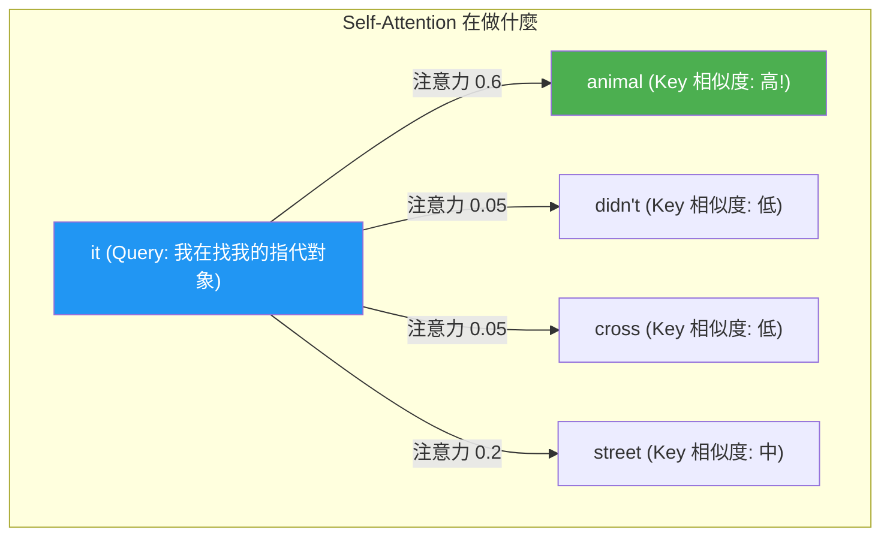

#### 數學定義

每個 token 會被投影成三個向量：

- **Query (Q)**：「我在找什麼」
- **Key (K)**：「我有什麼可以被找」  
- **Value (V)**：「如果有人找我，我給他什麼」

這個比喻很常用：**想像一個圖書館 — Query 是你的搜尋關鍵字，Key 是每本書的索引標籤，Value 是書的實際內容。**

Attention 的計算公式：

$$\text{Attention}(Q, K, V) = \text{softmax}\left(\frac{QK^T}{\sqrt{d_k}}\right) V$$

拆解這個式子：

1. $QK^T$：每個 query 跟每個 key 算內積 → 算出「相似度分數」
2. $\sqrt{d_k}$：除以這個是為了避免內積太大導致 softmax 飽和（梯度消失）

> **為什麼要除以 $\sqrt{d_k}$？** 如果 Q 和 K 的每個維度都是均值 0、方差 1 的隨機變量，那 Q·K 的方差會是 $d_k$（因為是 $d_k$ 個獨立乘積的和）。當 $d_k$ = 64 時，內積可能輕易到達 ±8 的範圍。而 softmax 在輸入很大時梯度幾乎為 0（飽和了），所以除以 $\sqrt{64} = 8$ 把方差拉回 1，讓 softmax 工作在梯度比較健康的區間。
3. $\text{softmax}$：把分數轉成機率分布（總和為 1）
4. 最後乘上 V：根據機率分布，把所有 value 加權平均

**結論：每個位置的新表示，都是所有位置的 value 的加權和，權重由 query-key 相似度決定。**

#### 具體數值計算例子

假設句子是 "I love cats"，embedding 維度 $d_k = 4$（實際上 Transformer base 用 64）。

**Step 1：每個 token 乘上 $W^Q, W^K, W^V$ 得到 Q, K, V**

| Token | Q (我在找什麼) | K (我有什麼標籤) | V (我的實際內容) |
|-------|------|------|------|
| I | [1, 0, 1, 0] | [0, 1, 1, 0] | [1, 0, 0, 1] |
| love | [0, 1, 0, 1] | [1, 1, 0, 0] | [0, 1, 1, 0] |
| cats | [1, 1, 0, 0] | [0, 0, 1, 1] | [0, 0, 1, 1] |

**Step 2：$QK^T$ — 每個 query 跟每個 key 算內積**

以 "cats" 的 Q = [1, 1, 0, 0] 去跟所有 K 算：
- 跟 "I" 的 K [0, 1, 1, 0]：$1×0 + 1×1 + 0×1 + 0×0 = 1$
- 跟 "love" 的 K [1, 1, 0, 0]：$1×1 + 1×1 + 0×0 + 0×0 = 2$
- 跟 "cats" 的 K [0, 0, 1, 1]：$1×0 + 1×0 + 0×1 + 0×1 = 0$

**Step 3：除以 $\sqrt{d_k} = \sqrt{4} = 2$**

→ [0.5, 1.0, 0.0]

**Step 4：Softmax**

→ [0.23, 0.38, 0.39] ... 等等，算一下：$e^{0.5}/(e^{0.5}+e^{1.0}+e^{0.0}) = 1.65/5.37 = 0.307$，$e^{1.0}/5.37 = 0.506$，$e^{0.0}/5.37 = 0.186$

→ **[0.307, 0.506, 0.186]** — "cats" 最關注 "love"！

**Step 5：加權平均 V**

$0.307 × [1,0,0,1] + 0.506 × [0,1,1,0] + 0.186 × [0,0,1,1]$  
$= [0.307, 0.506, 0.692, 0.493]$

這就是 "cats" 經過 self-attention 後的新表示 — 它融合了整句話的資訊，尤其是 "love" 的資訊（因為注意力權重最高）。

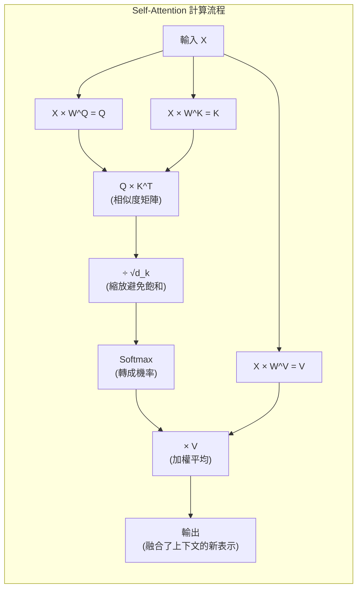

### Multi-Head Attention（多頭注意力）

只用一個 attention 不夠 — 一個字可能同時要關注「語法上的主詞」、「意義上的相關物」、「位置上的鄰居」等等。所以 Transformer 用 **多個 attention 平行跑**：

$$\text{MultiHead}(Q, K, V) = \text{Concat}(\text{head}_1, ..., \text{head}_h) W^O$$

$$\text{head}_i = \text{Attention}(QW_i^Q, KW_i^K, VW_i^V)$$

原始論文用 8 個 head，每個 head 看的「角度」不同。後來研究發現：**有些 head 真的會學到語法依賴關係，有些會學到位置 pattern**，這種專業分工是自然湧現的。

#### Multi-Head 直觀理解

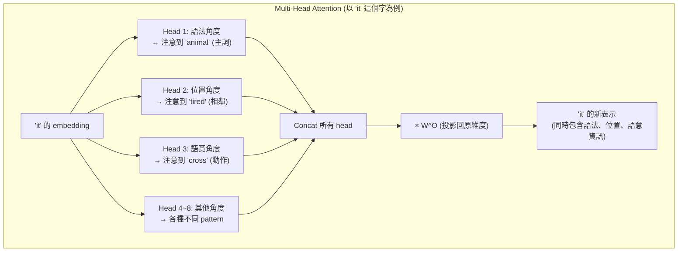

> **為什麼要「多頭」而不是一個大 attention？** 假設 $d_{model} = 512$，用 1 個 head 就是在 512 維空間裡找相似度，但 8 個 head 各自在 64 維子空間裡找。這就像是 8 個專家各自專注看不同面向，最後彙整意見。如果只有一個 head，它可能只學到一種 attention pattern（比如只看前後鄰居），無法同時捕捉多種關係。

### Positional Encoding（位置編碼）

Self-attention 有一個大問題：**它是 permutation-invariant 的**。也就是說：

> "The cat sat on the mat" 和 "mat the on sat cat The"

對 self-attention 來說是一樣的！因為它只看 token 之間的關係，不看順序。

解法：**把位置資訊「加」到 input embedding 上**。

原始 Transformer 用 sin/cos 的固定函數：

$$PE_{(pos, 2i)} = \sin(pos / 10000^{2i/d_{model}})$$

$$PE_{(pos, 2i+1)} = \cos(pos / 10000^{2i/d_{model}})$$

這樣設計有兩個好處：
1. 不同位置有不同的 encoding（明顯）
2. 透過三角函數的性質，模型可以學到「相對位置」的概念

> **為什麼三角函數能表達相對位置？** 因為 $\sin(A+B) = \sin A \cos B + \cos A \sin B$，所以位置 $pos+k$ 的 encoding 可以表示為位置 $pos$ 的 encoding 的線性組合。這意味著模型可以用一個固定的線性變換從 $PE_{pos}$ 算出 $PE_{pos+k}$，不管 $pos$ 是什麼 — 這就是「相對距離 $k$」的概念被編碼進去了。

#### 具體例子：Positional Encoding 長什麼樣

假設 $d_{model} = 4$（實際是 512），看前 4 個位置：

| pos | PE dim 0 ($\sin$) | PE dim 1 ($\cos$) | PE dim 2 ($\sin$) | PE dim 3 ($\cos$) |
|-----|----------|----------|----------|----------|
| 0 | sin(0) = 0 | cos(0) = 1 | sin(0) = 0 | cos(0) = 1 |
| 1 | sin(1) = 0.84 | cos(1) = 0.54 | sin(0.01) = 0.01 | cos(0.01) = 1.0 |
| 2 | sin(2) = 0.91 | cos(2) = -0.42 | sin(0.02) = 0.02 | cos(0.02) = 1.0 |
| 3 | sin(3) = 0.14 | cos(3) = -0.99 | sin(0.03) = 0.03 | cos(0.03) = 1.0 |

低維度變化快（像秒針），高維度變化慢（像時針）。每個位置的 pattern 都是唯一的，就像一個「位置的指紋」。

後來的模型（BERT、GPT）改成 **learnable positional embedding**，效果差不多。再後來有了 RoPE、ALiBi 這些更複雜的位置編碼方式。

> **術語解釋 — RoPE (Rotary Position Embedding)**：2021 年 Su 等人提出，用旋轉矩陣來編碼位置。核心想法是：位置 $m$ 跟位置 $n$ 的 attention score 只取決於相對距離 $m-n$（因為兩個旋轉矩陣相乘後角度會相消）。LLaMA、GPT-NeoX 都用這個。
>
> **術語解釋 — ALiBi (Attention with Linear Biases)**：2022 年 Press 等人提出，不把位置加到 embedding 上，而是直接在 attention score 上加一個跟距離成正比的 penalty：距離越遠，attention 分數被減越多。優點是可以直接外推到比訓練長度更長的序列。

### Transformer 完整架構

Transformer 是 **Encoder-Decoder** 架構（原本是為了翻譯設計的）：

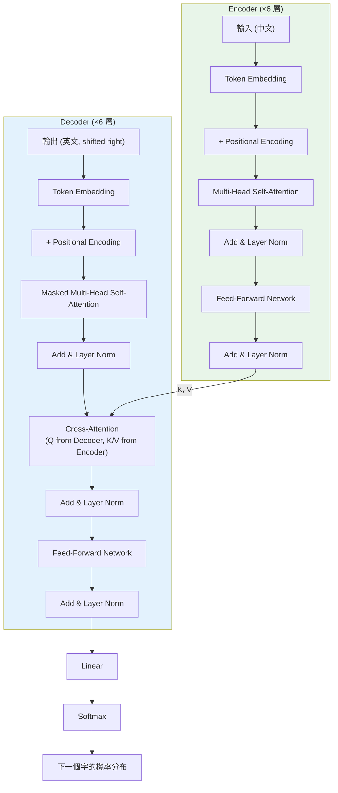

#### Encoder 和 Decoder 如何互動（翻譯 "我愛貓" → "I love cats" 為例）

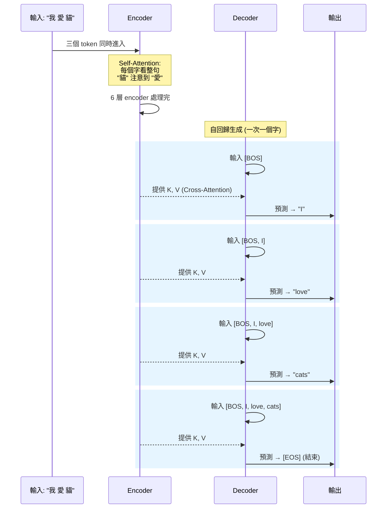

### Encoder Block 的組成

每個 encoder block 有兩個 sub-layer：

1. **Multi-Head Self-Attention**：每個位置看所有位置
2. **Position-wise Feed-Forward Network**：對每個位置獨立做兩層 MLP
   $$FFN(x) = \max(0, xW_1 + b_1)W_2 + b_2$$

> **術語解釋 — Position-wise**：意思是 FFN 對序列中每個位置**獨立**套用同一組權重。如果句子有 10 個 token，FFN 就是對這 10 個 token 分別做相同的兩層 MLP，彼此之間不交互。交互的部分已經由前面的 self-attention 處理好了。FFN 的作用是在每個位置上做更多的非線性計算，增加模型的表達能力。

每個 sub-layer 都包了：
- **Residual connection**：$x + \text{Sublayer}(x)$ — 幫助訓練深層網路
- **Layer Normalization**：穩定訓練

> **術語解釋 — Residual Connection（殘差連接）**：就是「把輸入直接加到輸出上」。公式是 $\text{output} = x + F(x)$。好處是：如果 $F(x)$ 學不到什麼有用的東西（梯度為 0），那至少 $x$ 還能原封不動通過 — 模型不會因為疊太深就退化。這讓 Transformer 可以安全地疊 6、12、甚至 96 層。

> **術語解釋 — Layer Normalization**：對每個 sample 的每一層的 hidden vector 做正規化（使均值=0，方差=1），然後再用兩個可學習參數 $\gamma, \beta$ 做縮放平移。跟 Batch Norm 不同的是，Layer Norm 不依賴 batch 內的其他 sample，所以在序列模型（每個序列長度不同）中更穩定。

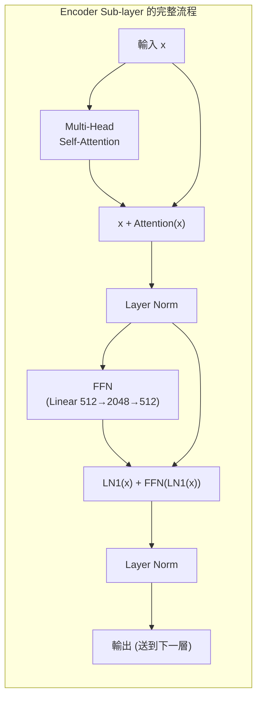

### Decoder Block 的組成

Decoder 比 encoder 多一個 sub-layer，總共三個：

1. **Masked Multi-Head Self-Attention**：自己看自己，但要 mask 掉未來的 token（生成的時候不能偷看答案）
2. **Cross-Attention**：Q 來自 decoder，K、V 來自 encoder — 這是 encoder 跟 decoder 溝通的橋樑
3. **Feed-Forward Network**

#### Masked Self-Attention 的 Mask 長什麼樣？

假設 decoder 正在生成 "I love cats"，attention mask 矩陣：

|  | I | love | cats |
|---|---|---|---|
| **I** | ✓ | ✗ | ✗ |
| **love** | ✓ | ✓ | ✗ |
| **cats** | ✓ | ✓ | ✓ |

- 生成 "I" 的時候只能看自己
- 生成 "love" 的時候能看 "I" 和自己
- 生成 "cats" 的時候能看前面所有字

被 mask 掉的位置會被設成 $-\infty$，經過 softmax 後就變成 0（完全不注意）。

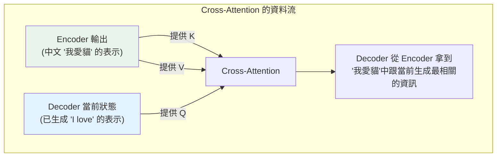

> **Cross-Attention 白話理解**：Decoder 在生成下一個英文字的時候，用自己目前的狀態（Q）去「問」Encoder：「中文原文裡面，哪些部分跟我現在要生成的東西最有關？」Encoder 提供 K（索引）和 V（內容）作為回答。這就是翻譯模型能「對齊」中英文的機制。

### 為什麼 Transformer 這麼成功？

1. **完全平行化**：所有位置可以同時計算，GPU 吃滿
2. **長距離依賴一步到位**：任何兩個位置都直接連接，不用像 RNN 一樣傳很多步
3. **Scalable**：層數加深、寬度加寬都能持續變強，這是後來 GPT-3、GPT-4 的基礎

#### RNN vs Transformer 處理長距離依賴的比較

```mermaid
graph LR
    subgraph "RNN: 位置 1 的資訊要到位置 10"
        R1["pos 1"] --> R2["pos 2"] --> R3["pos 3"] --> R4["..."] --> R10["pos 10"]
    end
```

```mermaid
graph LR
    subgraph "Transformer: 位置 1 的資訊到位置 10"
        T1["pos 1"] -->|"一步 attention"| T10["pos 10"]
    end
```

| 比較項目 | RNN/LSTM | Transformer |
|---------|----------|-------------|
| 位置 1 → 位置 n 的路徑長度 | O(n) 步 | O(1) 步 |
| 每層的計算複雜度 | O(n) (序列) | O(n²) (但可平行) |
| 平行度 | 不能平行（每步依賴前步） | 完全平行 |
| 實際 GPU 訓練速度 | 慢 | 快非常多 |
| 記憶長度上限 | ~10-20 步（梯度消失） | 理論上無限（但受限於 O(n²) 記憶體） |

---

## 6. BERT vs GPT — 兩條技術路線

Transformer 原本是 encoder-decoder 一起用的（為了翻譯），但後來大家發現：**有時候只需要其中一邊就夠了**。這就分出了兩條路線。

```mermaid
graph TB
    T["Transformer (2017)<br/>Encoder-Decoder"] --> BERT["BERT (2018)<br/>只用 Encoder<br/>雙向理解"]
    T --> GPT["GPT (2018)<br/>只用 Decoder<br/>單向生成"]
    
    BERT --> RoBERTa["RoBERTa (2019)"]
    BERT --> DeBERTa["DeBERTa (2020)"]
    BERT --> ALBERT["ALBERT (2019)"]
    
    GPT --> GPT2["GPT-2 (2019)"]
    GPT2 --> GPT3["GPT-3 (2020)"]
    GPT3 --> ChatGPT["ChatGPT (2022)"]
    GPT3 --> GPT4["GPT-4 (2023)"]
    
    GPT --> LLaMA["LLaMA (2023)"]
    
    style BERT fill:#E8F5E9
    style GPT fill:#E3F2FD
    style T fill:#FFF9C4
```

### BERT（Bidirectional Encoder Representations from Transformers）

- **架構**：Encoder-only，把 Transformer 的 encoder 疊很多層（base 12 層、large 24 層）
- **訓練目標**：
  1. **Masked Language Model (MLM)**：隨機遮住 15% 的 token，讓模型猜被遮的是什麼。因為是雙向的（self-attention 可以看到左右兩邊），所以是真正的「雙向理解」
  2. **Next Sentence Prediction (NSP)**：給兩個句子，判斷是不是連續的（後來 RoBERTa 證明這個任務沒什麼用，被拿掉了）
- **適合的任務**：分類、NER、QA、句子相似度 — **理解類任務**

#### MLM 具體例子

原始句子："The cat sat on the mat"

BERT 訓練時的輸入：  
"The cat [MASK] on the mat"

BERT 要預測 [MASK] = "sat"（它可以看左邊的 "The cat" 也可以看右邊的 "on the mat"，所以是雙向的）

> **術語解釋 — NER (Named Entity Recognition)**：命名實體識別，就是在文字中找出人名、地名、組織名等有特定意義的詞彙。例如「蘋果公司在庫比蒂諾」→ [蘋果公司=ORG, 庫比蒂諾=LOC]。BERT 很適合這類任務，因為判斷「蘋果」是公司還是水果需要看上下文。

### GPT（Generative Pre-trained Transformer）

- **架構**：Decoder-only，把 Transformer 的 decoder 疊很多層（沒有 cross-attention，因為沒有 encoder 要 attend）
- **訓練目標**：**Causal Language Model (CLM)** — 根據前面的字預測下一個字（這是純粹的「左到右」）
- **適合的任務**：文字生成、對話、寫程式 — **生成類任務**

#### BERT 和 GPT 看同一句話的差異

```mermaid
graph LR
    subgraph "BERT: 'The cat [MASK] on the mat'"
        B_The["The"] <-->|"雙向"| B_cat["cat"]
        B_cat <-->|"雙向"| B_MASK["[MASK]"]
        B_MASK <-->|"雙向"| B_on["on"]
        B_on <-->|"雙向"| B_the["the"]
        B_the <-->|"雙向"| B_mat["mat"]
    end
```

```mermaid
graph LR
    subgraph "GPT: 'The cat sat on the ___'"
        G_The["The"] --> G_cat["cat"]
        G_cat --> G_sat["sat"]
        G_sat --> G_on["on"]
        G_on --> G_the["the"]
        G_the --> G_pred["預測: mat"]
    end
```

BERT 預測中間被遮住的字（完形填空），GPT 只能從左到右生成下一個字。

### 一張表看清楚

| | BERT | GPT |
|---|---|---|
| 架構 | Encoder-only | Decoder-only |
| 注意力 | 雙向 | 單向（causal mask） |
| 訓練目標 | MLM + NSP | 預測下一個 token |
| 強項 | 理解 | 生成 |
| 代表後繼 | RoBERTa, DeBERTa | GPT-3, GPT-4, Llama |

### 為什麼最後 GPT 路線贏了？

雖然 BERT 在理解任務上很強，但有一個關鍵差異：**GPT 的訓練目標跟「人類使用語言」更接近**。我們講話、寫文章都是一個字一個字往下產生的，所以 GPT 的能力可以很自然地用在所有任務上 — 你只要把任務描述成「prompt → completion」就好。

#### 具體例子：同一個任務兩種模型怎麼做

**任務：判斷「這部電影太無聊了」是正面還是負面**

BERT 的做法：
```
輸入: [CLS] 這部電影太無聊了 [SEP]
      → 取 [CLS] 的 hidden state → 接一個分類頭 → sigmoid → 負面 (0.95)
```
需要額外訓練一個分類頭（fine-tune）。

GPT 的做法：
```
輸入: "判斷以下句子的情感：「這部電影太無聊了」\n答案："
      → 模型直接生成 → "負面"
```
不需要任何額外訓練（zero-shot），用 prompt 就能做！

> 這就是 **「Prompt 即任務」** 的核心概念 — GPT-3 論文把這叫做 in-context learning。你只要在 prompt 裡描述清楚任務，模型就能做。這讓一個模型能處理幾乎所有 NLP 任務，不需要為每個任務都 fine-tune。

這就是為什麼現在大家都在做 decoder-only 的大模型，而 BERT 變成「特定任務的工具」而不是通用模型。

---

## 7. 多模態模型 — CLIP, BLIP, LLaVA

### 多模態的核心想法

> **把不同模態（圖、文、音、影片）的資料，都壓(對齊)到同一個向量空間裡面，剩下的就是常見的 ML 任務了。**

這句話聽起來簡單，但它解釋了現在所有多模態模型的設計哲學。

```mermaid
graph TB
    subgraph "多模態的核心概念"
        Img["🖼️ 圖片"] -->|"Vision Encoder"| Space["共享向量空間"]
        Txt["📝 文字"] -->|"Text Encoder"| Space
        Audio["🎵 音訊"] -->|"Audio Encoder"| Space
        Video["🎬 影片"] -->|"Video Encoder"| Space
        
        Space --> Task1["比較相似度 → 檢索"]
        Space --> Task2["分類"]
        Space --> Task3["生成"]
    end
```

> **白話比喻**：想像你有一本「萬能翻譯字典」，不管你給它一張貓的照片、「一隻橘色的貓」這段文字、或者貓叫聲的音訊，它都能翻譯成同一個「概念向量」[0.8, 0.2, 0.9, ...]。一旦所有模態都說「同一種語言」（向量），你就能自由地比較、檢索、甚至跨模態生成。

### CLIP（Contrastive Language-Image Pre-training, OpenAI 2021）

#### 架構

```mermaid
graph LR
    subgraph "CLIP 架構"
        Img["圖片"] --> VE["Vision Encoder<br/>(ViT-L/14)"]
        VE --> ImgVec["圖片向量 v<br/>(512 維)"]
        
        Txt["文字"] --> TE["Text Encoder<br/>(Transformer)"]
        TE --> TxtVec["文字向量 t<br/>(512 維)"]
        
        ImgVec --> Sim["Cosine Similarity"]
        TxtVec --> Sim
        Sim --> Match["配對的相似度要高<br/>不配對的要低"]
    end
```

#### 訓練方式：Contrastive Learning

收 4 億組（圖片, 文字描述）的 pair，每個 batch 拿 N 對：

- **Positive pair**：原本配對的那一對 → 推近（cosine similarity 變大）
- **Negative pair**：跟其他圖配對 → 推遠（cosine similarity 變小）

#### Contrastive Learning 具體例子

假設 batch size = 3，有三對：

| | 圖片 | 文字 |
|---|---|---|
| Pair 1 | 🐱 貓的照片 | "a photo of a cat" |
| Pair 2 | 🐕 狗的照片 | "a cute dog playing" |
| Pair 3 | 🚗 車的照片 | "a red car on the road" |

Similarity 矩陣（我們希望對角線高，其他低）：

```mermaid
graph TD
    subgraph "Contrastive Learning 的目標"
        M["相似度矩陣 (N×N)"]
        Target["目標: 對角線 → 1, 其他 → 0"]
        
        M --> |"貓圖 × 貓文 = 0.9 ✓"| Target
        M --> |"貓圖 × 狗文 = 0.1 ✓"| Target
        M --> |"貓圖 × 車文 = 0.05 ✓"| Target
    end
```

| | "a photo of a cat" | "a cute dog playing" | "a red car on the road" |
|---|---|---|---|
| 🐱 貓圖 | **0.92** (推高 ↑) | 0.15 (推低 ↓) | 0.03 (推低 ↓) |
| 🐕 狗圖 | 0.18 (推低 ↓) | **0.89** (推高 ↑) | 0.05 (推低 ↓) |
| 🚗 車圖 | 0.02 (推低 ↓) | 0.04 (推低 ↓) | **0.91** (推高 ↑) |

訓練完後，相關的圖跟文字會在向量空間裡靠在一起，無關的會分得很開。

> **術語解釋 — Cosine Similarity**：兩個向量之間角度的 cos 值。$\cos(a, b) = \frac{a \cdot b}{|a||b|}$。值域是 [-1, 1]，1 代表方向完全相同，0 代表正交（無關），-1 代表完全相反。用角度而不是距離的好處是不受向量長度影響 — 只看「方向」是否一致。

#### CLIP 為什麼神？

訓練完後可以直接做 **zero-shot classification**：
- 想分類一張圖是貓還是狗？
- 把 "a photo of a cat"、"a photo of a dog" 各自編碼成文字向量
- 跟圖片向量算 cosine similarity，誰高就分到哪類
- **完全不用為了分類任務再訓練！**

```mermaid
flowchart LR
    subgraph "CLIP Zero-Shot Classification"
        Photo["未知圖片<br/>(其實是一隻貓)"] --> VE["Vision Encoder"]
        VE --> V["圖片向量"]
        
        T1["'a photo of a cat'"] --> TE1["Text Enc"] --> TV1["文字向量 1"]
        T2["'a photo of a dog'"] --> TE2["Text Enc"] --> TV2["文字向量 2"]
        T3["'a photo of a car'"] --> TE3["Text Enc"] --> TV3["文字向量 3"]
        
        V --> C1["cos(v, t1) = 0.92"]
        TV1 --> C1
        V --> C2["cos(v, t2) = 0.31"]
        TV2 --> C2
        V --> C3["cos(v, t3) = 0.05"]
        TV3 --> C3
        
        C1 --> Result["預測: 貓! ✓"]
    end
    
    style C1 fill:#4CAF50,color:white
    style Result fill:#4CAF50,color:white
```

> **術語解釋 — Zero-Shot Classification**：模型在**完全沒有看過任何標注好的分類範例**的情況下就能做分類。傳統做法需要收集幾千張標注「貓/狗/車」的圖片去訓練分類器。CLIP 因為學到了「圖和文的對齊」，所以你只要**用自然語言描述類別**，它就能分類。甚至你可以隨時新增類別（比如 "a photo of a capybara"），不需要重新訓練。

### BLIP（Bootstrapping Language-Image Pre-training, Salesforce 2022）

CLIP 主要是做 **理解/檢索**，BLIP 想要連 **生成（caption）** 也一起做。

BLIP 同時訓練三個任務：
1. **Image-Text Contrastive (ITC)**：跟 CLIP 一樣
2. **Image-Text Matching (ITM)**：給一對圖文，判斷是否匹配（更細的監督）
3. **Image-Conditioned Language Modeling (LM)**：看圖片產生 caption

BLIP-2 後來引入了 **Q-Former**（Querying Transformer）— 用一組 learnable query，從 vision encoder 抽取最有用的視覺資訊，再餵給凍結的 LLM。

```mermaid
graph LR
    subgraph "BLIP-2 架構"
        Img["圖片"] --> FrozenVE["凍結的<br/>Vision Encoder"]
        FrozenVE --> VF["視覺特徵<br/>(很多很多 token)"]
        
        LQ["32 個 Learnable Queries"] --> QF["Q-Former<br/>(Cross-Attention)"]
        VF --> QF
        
        QF --> CompressedV["壓縮的視覺表示<br/>(只有 32 個 token!)"]
        CompressedV --> FrozenLLM["凍結的 LLM<br/>(OPT/FlanT5)"]
        FrozenLLM --> Output["生成 caption"]
    end
    
    style FrozenVE fill:#FFE0B2
    style FrozenLLM fill:#FFE0B2
    style QF fill:#C8E6C9
```

> **Q-Former 白話理解**：Vision Encoder 輸出的視覺特徵可能有幾百個 token（例如 ViT-L 輸出 257 個），全部餵給 LLM 太浪費了（位置也太多）。Q-Former 用 32 個「可學習的提問」去 cross-attend 那幾百個視覺 token，把最重要的資訊濃縮成 32 個 token 就好。這就像派 32 個記者去採訪一場有 257 個發言人的會議 — 每個記者問不同的問題，最後整理出精華摘要。

### LLaVA（Large Language and Vision Assistant, 2023）

LLaVA 的設計更簡單粗暴，但效果出奇地好：

#### 架構

```mermaid
graph TB
    subgraph "LLaVA 架構"
        Img["圖片"] --> CLIP_VE["CLIP ViT-L/14<br/>Vision Encoder<br/>(凍結)"]
        CLIP_VE --> ZV["視覺特徵 Z_v"]
        ZV --> Proj["Projection Layer<br/>(2層 MLP, v1.5)<br/>★ 只訓練這個"]
        Proj --> VTokens["視覺 Token<br/>(跟文字 token 同維度)"]
        
        Prompt["文字 Prompt:<br/>'Describe this image'"] --> Tok["Tokenizer"]
        Tok --> TTokens["文字 Token"]
        
        VTokens --> Concat["串接"]
        TTokens --> Concat
        
        Concat --> LLM["LLaMA / Vicuna<br/>(LLM)"]
        LLM --> Answer["回答:<br/>'This is a photo of...'"]
    end
    
    style CLIP_VE fill:#FFE0B2
    style Proj fill:#C8E6C9
    style LLM fill:#BBDEFB
```

#### 核心想法

1. **拿凍結的 CLIP vision encoder 抽特徵**
2. **用一個簡單的 projection layer**（最早是 linear，後來 1.5 版改成兩層 MLP）**把視覺特徵投影到 LLM 的 embedding 空間**
3. **把投影後的視覺向量當成「視覺 token」**，跟文字 token 串在一起餵給 LLM
4. **LLM 完全不知道差別** — 對它來說只是多了一些「特殊的 token」

訓練分兩階段：
- **Stage 1**：只訓練 projection layer，用圖文對齊資料
- **Stage 2**：用 GPT-4 生成的 instruction-following 資料做 visual instruction tuning

#### LLaVA 訓練流程

```mermaid
flowchart TB
    subgraph Stage1["Stage 1: Pre-training (對齊)"]
        direction LR
        D1["595K 圖文對<br/>(CC3M 子集)"] --> Train1["只訓練 Projection Layer<br/>Vision Encoder 凍結<br/>LLM 凍結"]
        Train1 --> Goal1["目標: 讓視覺 token<br/>跟文字 token 活在同一空間"]
    end
    
    subgraph Stage2["Stage 2: Fine-tuning (指令跟隨)"]
        direction LR
        D2["158K GPT-4 生成的<br/>Visual Instructions"] --> Train2["訓練 Projection Layer + LLM<br/>Vision Encoder 仍凍結"]
        Train2 --> Goal2["目標: 讓模型能回答<br/>關於圖片的複雜問題"]
    end
    
    Stage1 --> Stage2
    
    style Stage1 fill:#E8F5E9
    style Stage2 fill:#E3F2FD
```

> **為什麼 LLaVA 這麼簡單卻有效？** 核心 insight 是：CLIP 已經把圖片 encode 成很好的視覺表示了，LLaMA 已經是很強的語言模型了。唯一缺的就是「一座橋」讓兩邊能溝通。Projection Layer 就是這座橋 — 它把 CLIP 的視覺向量「翻譯」成 LLaMA 看得懂的「語言」（token embedding）。LLaMA 收到這些「假的 token」之後，會像處理普通文字一樣處理它們。

### 三個模型的對比

| | CLIP | BLIP | LLaVA |
|---|---|---|---|
| 主要能力 | 檢索、零樣本分類 | 檢索 + 生成 caption | 對話式視覺問答 |
| Vision Encoder | ViT/CNN | ViT | CLIP ViT (凍結) |
| 連接方式 | 共享 embedding | Q-Former (BLIP-2) | Projection layer |
| 語言端 | Text encoder | Text encoder + decoder | LLM (Vicuna/LLaMA) |
| 設計哲學 | 對齊兩個空間 | 多任務聯合訓練 | 把視覺翻譯成 LLM 看得懂的「語言」 |

### 融合策略（學弟做作業會用到）

| 策略 | 說明 | 例子 |
|------|------|------|
| **Early Fusion** | 在很早的階段就把不同模態串起來 | 直接把圖片向量跟文字向量 concat 後丟進同一個模型 |
| **Late Fusion** | 各自處理到最後才合併 | CLIP（兩個 encoder 各自跑完才算 similarity） |
| **Cross-Attention Fusion** | 讓一個模態的 query 去 attend 另一個模態的 key/value | Flamingo, BLIP-2 的 Q-Former |
| **Unified Token Fusion** | 把所有模態都變成 token 餵給同一個 Transformer | LLaVA, GPT-4V |

```mermaid
graph TB
    subgraph "Early Fusion"
        E_I["圖片特徵"] --> E_C["Concat"]
        E_T["文字特徵"] --> E_C
        E_C --> E_M["共同模型處理"]
    end
    
    subgraph "Late Fusion"
        L_I["圖片"] --> L_VE["Vision Model<br/>(完整處理)"]
        L_T["文字"] --> L_TE["Text Model<br/>(完整處理)"]
        L_VE --> L_C["最後才合併<br/>(similarity/concat)"]
        L_TE --> L_C
    end
    
    subgraph "Cross-Attention"
        CA_I["圖片特徵<br/>(K, V)"] --> CA_A["Cross-Attention"]
        CA_T["文字特徵<br/>(Q)"] --> CA_A
        CA_A --> CA_O["融合表示"]
    end
    
    subgraph "Unified Token"
        UT_I["圖片 → Visual Tokens"] --> UT_T["統一 Transformer"]
        UT_T2["文字 → Text Tokens"] --> UT_T
        UT_T --> UT_O["統一處理<br/>(不區分模態)"]
    end
```

#### 如何選擇融合策略？

```mermaid
flowchart TD
    Q1{"你的兩個模態<br/>需要深度交互嗎？"}
    Q1 -->|"不需要<br/>(只需比較相似度)"| Late["Late Fusion<br/>例: 圖文檢索"]
    Q1 -->|"需要"| Q2{"你有大型預訓練<br/>模型可以用嗎？"}
    Q2 -->|"有 (凍結的 LLM)"| Q3{"視覺資訊量大嗎？"}
    Q3 -->|"大，需要壓縮"| Cross["Cross-Attention<br/>例: BLIP-2 Q-Former"]
    Q3 -->|"可以直接餵"| Unified["Unified Token<br/>例: LLaVA"]
    Q2 -->|"沒有<br/>(從頭訓練)"| Early["Early Fusion<br/>例: 小型多模態模型"]
```

---

## 8. 作業說明

### 設計你自己的模型

請學弟們下面挑一個來做，當然都做是最好的:

1. **RNN 文字分類**
手刻一個簡單 RNN,跑情感分析或翻譯
感受 sequential processin
2. **Mini Self-Attention**
用 PyTorch 寫一個 single-head attention
然後跑一個視覺化 attention map 的圖片，如果能生成可以互動的工具就更好了
> 其實有現成套件可以用 [bertviz](https://github.com/jessevig/bertviz)
3. **BERT Fine-tuning**
用 HuggingFace 拉 [BERT](https://huggingface.co/google-bert/bert-base-uncased)(可以自己找，不一定要用我提供的)
fine-tune 一個下游任務，看是要分類任務、NER等等的都可以
